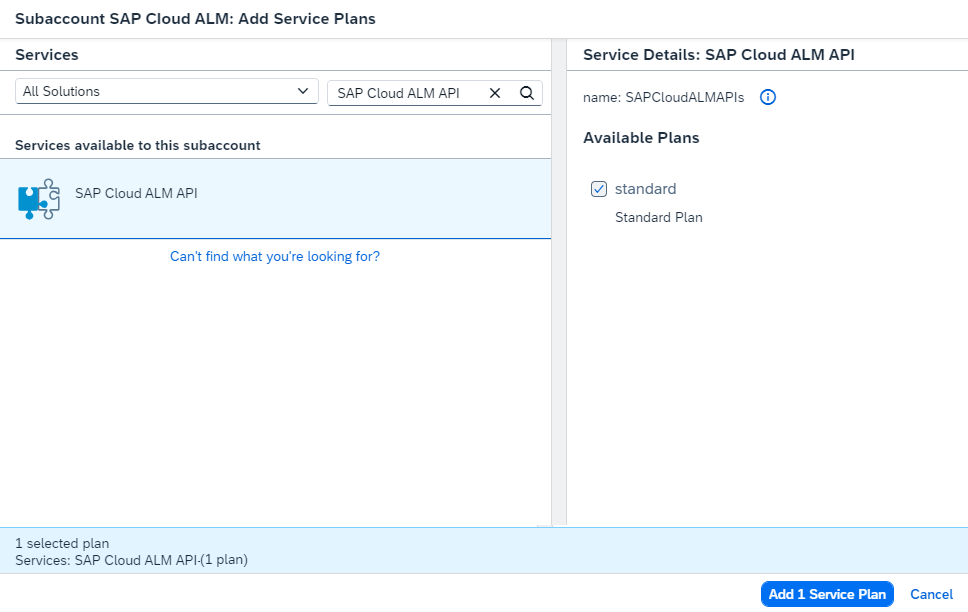
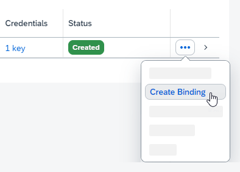
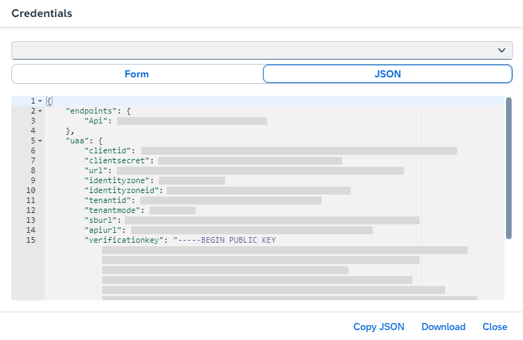

<!-- loio704b5dc854f549888a238f94015e1eac -->

<link rel="stylesheet" type="text/css" href="../css/sap-icons.css"/>

# Enabling SAP Cloud ALM API

To set up the connection between your managed systems and individual SAP Cloud ALM applications, you need to retrieve your binding credentials and connect your SAP services and systems to your SAP Cloud ALM instance


Depending on the provisioning date of your SAP Cloud ALM tenant, some or all steps described in this document have already been automatically completed for you:


<table>
<tr>
<th valign="top">

Provisioning Date

</th>
<th valign="top">

Actions

</th>
</tr>
<tr>
<td valign="top">

On or after 2023-10-16

</td>
<td valign="top">

A binding was generated automatically.

You can skip these steps altogether and access your binding in the SAP BTP cockpit or in the *Landscape Management* app, as described in [Managing Your Service Key](managing-your-service-key-87b7851.md).

</td>
</tr>
<tr>
<td valign="top">

Between 2023-06-12 and 2023-10-16

</td>
<td valign="top">

A service key that can be used to connect managed services to SAP Cloud ALM for Operations monitoring applications was generated automatically.

You can access it in the SAP BTP cockpit or in the *Landscape Management* app, as described in [Managing Your Service Key](managing-your-service-key-87b7851.md).

You only need to carry out these steps if you want to set up transport management, but you no longer have to configure your entitlements.

</td>
</tr>
<tr>
<td valign="top">

Before 2023-06-12

</td>
<td valign="top">

No service key or binding has been created as part of the initial provisioning. To create one manually, carry out the steps listed below.

</td>
</tr>
</table>

> ### Note:  
> This document describes how to retrieve a service key without a Cloud Foundry organization.
> 
> You can access it in the SAP BTP cockpit or in theIf a Cloud Foundry organization and space already exist in your SAP Cloud ALM subaccount \(as shown in the image below\) and are already in use in the context of SAP Cloud ALM APIs, you can also follow [Enabling SAP Cloud ALM API in Cloud Foundry](enabling-sap-cloud-alm-api-in-cloud-foundry-7d4c180.md). However, we strongly recommend following the approach **without** Cloud Foundry.
> 
> 


<a name="loio704b5dc854f549888a238f94015e1eac__section_wpy_rnj_jmb"/>

## Prerequisites

Your user has the role *Global Account Administrator* in the global account that was created when you requested SAP Cloud ALM, and is a member of the subaccount containing your SAP Cloud ALM subscription.

If you don't have this role, the global account administrator can assign it to you by following the steps described in [Add Members to Your Global Account](https://help.sap.com/viewer/65de2977205c403bbc107264b8eccf4b/LATEST/en-US/4a0491330a164f5a873fa630c7f45f06.html).


<a name="loio704b5dc854f549888a238f94015e1eac__section_lv5_hh4_xlbs"/>

## Procedure


### Configure Entitlements

An entitlement is your right to provision and consume a resource.

1.  Open the SAP BTP cockpit.

2.  Select the global account that contains your SAP Cloud ALM entitlement, which was created when you requested SAP Cloud ALM.

3.  Under *Subaccounts*, select the subaccount that contains your SAP Cloud ALM subscription.

4.  In the menu, go to *Entitlements*.

5.  Choose *Edit* \> *Add Service Plans*.

6.  Add the required service plan as follows:

    1.  Select the entitlement *SAP Cloud ALM API*.

    2.  Under *Available Plans*, check the option *standard*.

    3.  Choose *Add 1 Service Plan*.

        


7.  Save.


### Maintain an Instance

1.  Choose *Services* \> *Instances and Subscriptions*.

2.  If you already have an instance, choose <span class="SAP-icons-V5"></span> \(Actions\) and select *Update*. Then proceed to step 4.

    If you don't have an instance yet, choose *Create*.

3.  Under *Basic Info*, provide the following details:

    -   *Service*: `SAP Cloud ALM API`

    -   *Plan*: `standard`

    -   *Runtime Environment*: `Other`

    -   *Instance Name*: Enter a meaningful instance name.

        The length of the instance name must not exceed 32 characters. Use only alphanumeric characters, numbers from 0 to 9, periods, and hyphens. Instead of spaces, use underscores.

        


4.  Choose *Next*.

5.  Paste the following JSON code into the text editor:

    ```
    {
        "xs-security": {
            "xsappname": "<your-instance-name>",
            "authorities": [
               "$XSMASTERAPPNAME.imp-cdm-feature-display-ui",
               "$XSMASTERAPPNAME.imp-cdm-feature-manage-ui"
            ],
            "oauth2-configuration": {
                "credential-types": [
                    "binding-secret"
                ]
            }
        }
    }
    
    ```

6.  Replace `<your-instance-name>` with your instance name.

7.  Choose *Create*.

8.  When your instance has been created or updated, click on it.


### Create a Binding

Bindings allow you to configure an external application so that it can connect to an SAP Cloud ALM API service instance.

1.  Next to your instance, choose <span class="SAP-icons-V5"></span> \(Actions\) and select *Create Binding*.

    

2.  Enter a name for your binding.

3.  Choose *Create*.

4.  Next to the created binding, choose <span class="SAP-icons-V5"></span> \(Actions\) and select *View*.

5.  You can now see your binding in JSON format.

    It includes the following information:

    -   The application base URL \(`endpoints.Api`\)

    -   The `clientid` and `clientsecret` to access the service

    -   The oAuth URL to generate the oAuth token \(`uaa.url`\)


    


> ### Caution:  
> Outside of the SAP BTP cockpit, bindings must be stored securely. If you need a binding, create the binding directly in the SAP BTP cockpit, and access it from there whenever you need it.

-   **[Enabling SAP Cloud ALM API in Cloud Foundry](enabling-sap-cloud-alm-api-in-cloud-foundry-7d4c180.md "To set up the connection between your managed systems and individual SAP Cloud ALM
		applications, you need to retrieve a service key or binding and connect your SAP services
		and systems to your SAP Cloud ALM instance.")**  
To set up the connection between your managed systems and individual SAP Cloud ALM applications, you need to retrieve a service key or binding and connect your SAP services and systems to your SAP Cloud ALM instance.
-   **[Managing Your Service Key](managing-your-service-key-87b7851.md "If you requested SAP Cloud ALM on or after 2023-06-14, an automatically generated SAP
		Cloud ALM service key was uploaded to the Landscape Management app
		for you. This key can be used to connect managed services to push monitoring data using
		OAuth 2.0.")**  
If you requested SAP Cloud ALM on or after 2023-06-14, an automatically generated SAP Cloud ALM service key was uploaded to the *Landscape Management* app for you. This key can be used to connect managed services to push monitoring data using OAuth 2.0.

**Related Information**  


[Entitlements and Quotas](https://help.sap.com/viewer/3504ec5ef16548778610c7e89cc0eac3/Cloud/en-US/00aa2c23479d42568b18882b1ca90d79.html)

[API Guide for SAP Cloud ALM](https://help.sap.com/docs/cloud-alm/apis/about)

