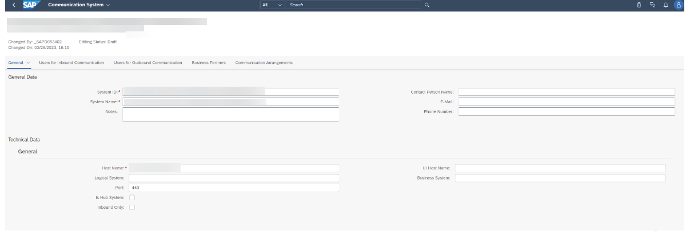
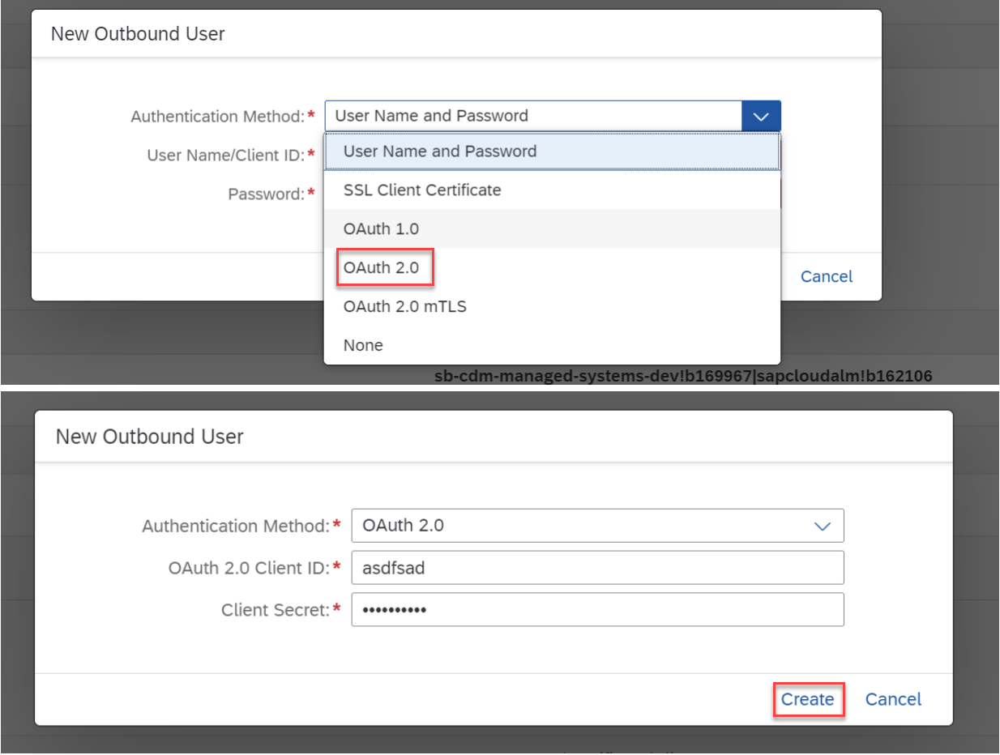

<!-- loioa4238a9e586046268a1de5ea03ec6930 -->

<link rel="stylesheet" type="text/css" href="../css/sap-icons.css"/>

# SAP S/4HANA Cloud with Adaptation Transport Organizer \(ATO\)

By enabling the transport management for SAP S/4HANA Cloud with the Adaptation Transport Organizer \(ATO\), you can orchestrate the deployment of transport requests through your implementation landscape.

In order to use the `ATO` for SAP S/4HANA Cloud in an SAP Cloud ALM environment, you have to establish a connection between SAP Cloud ALM and the `ATO`.

<a name="loioa4238a9e586046268a1de5ea03ec6930__section_i1h_2n3_wwb"/>

## Procedure

1.  **Retrieve SAP Cloud ALM API credentials**: As a first step, you need to create a space and configure your entitlements in the subaccount containing your SAP Cloud ALM subscription. To do this, perform the steps described in [Enabling SAP Cloud ALM API](enabling-sap-cloud-alm-api-704b5dc.md).

    > ### Note:  
    > For background information about communication systems in SAP S/4HANA Cloud context, please have a look at [Communication Management](https://help.sap.com/docs/SAP_S4HANA_CLOUD/0f69f8fb28ac4bf48d2b57b9637e81fa/2e84a10c430645a88bdbfaaa23ac9ff7.html?locale=en-US) 

2.  **Create communication system**: Create a communication system using the *Communication System* app that represents the SAP Cloud ALM tenant you want to communicate with.

    > ### Note:  
    > The following steps have to be performed for every tenant you want to establish.

    1.  In the *Communication Systems* app, set up a new communication system by choosing *New*.

        

        Set up a communication system using any ID in the *System ID* field and with a reasonable name \(for example the tenant name, you want to communicate with\) in the *System Name* field.

        

    2.  Choose *Create*.

    3.  In the next view, add the root URL from the SAP Cloud ALM API \(see step 1 of this guide\) in the*Host Name* field and the port \(443\) into the *Port* field in the *Technical Data - General* section.

        The relevant entry for the host name is the following: `{ “endpoints”: { “Api” . https://eu10.alm.cloud.sap/api }`. Enter the URL without the `/api` extension at the end.

        

    4.  Add a token URL based on the UAA url from your SAP Cloud ALM API instance in the *Token Endpoint* field and add `/oauth/token` at the end of the URL.

        The token URL in the service key JSON file looks like that:`"url": "https://tenant-name.authentication.eu10.hana.ondemand.com"`

        

    5.  To create a new outbound user, go to the *Users for Outbound Communication* section of the *Communication Systems* app and choose :heavy_plus_sign:.

        

    6.  Choose Oauth 2.0 in the *Authentication Method* dropdown and enter your credentials based on client ID and secret from your SAP Cloud ALM API instance in the *OAuth 2.0 Client ID* and *Client Secret* fields.

        You can find the client ID and secret in the UAA section of the service key JSON and has a structure like in the following examples:`"clientid": "instance-name!b123456|sapcloudalm!b456789"` and `"clientsecret": "asdfasdfasdfasdfasdfasdf"`.

        

    7.  Choose *Create*.

        The entry now looks like this:

        

    8.  Choose *Save*.

3.  **Create a communication arrangement**:

    1.  Create a communication arrangement in the *Communication Arrangement* app based on scenario SAP\_COM\_0690 and use the system that was created in step 2 of this guide.

        

    2.  Go to the *Outbound Services* section in the *Communication Arrangement* app. In this section you can find the following four outbound services.

        -   SAP Cloud ALM for implementation - Deployment Management Export

        -   SAP Cloud ALM for implementation - Deployment Management Import

        -   SAP Cloud ALM for implementation - Deployment Management Retry

        -   SAP Cloud ALM for implementation - Deployment Management Status Change

        In each of this outbound services, the same entries have to be filled out by you.

        

        Make sure that the *Service Status* is marked as *Active* and that the *Port* entry is filled out with 443.

        In the *Job Execution Details* section, the *Job Status* doesn't have to be checked as this will be scheduled automatically in the background. Enter 5 minutes in the *Run Every* field.

        The *Package Size* entry can be ignored.

    3.  Choose *Save*.

<a name="loioa4238a9e586046268a1de5ea03ec6930__section_sfl_qyk_gxb"/>

## Information About Available Outbound Services

The following list contains the outbound services that are currently available:

-   Export: This outbound scenario reacts to exported ATO collection versions

-   Import: This service notifies SAP Cloud ALM about imports that were performed by ATO

-   Retry: Retries failed communication between ATO and SAP Cloud ALM

-   Status Change: This service reacts to ATO status changes and sends these changes to SAP Cloud ALM

> ### Note:  
> The collector jobs can only react to future events once they are activated. Past actions before the activation are not collected.

