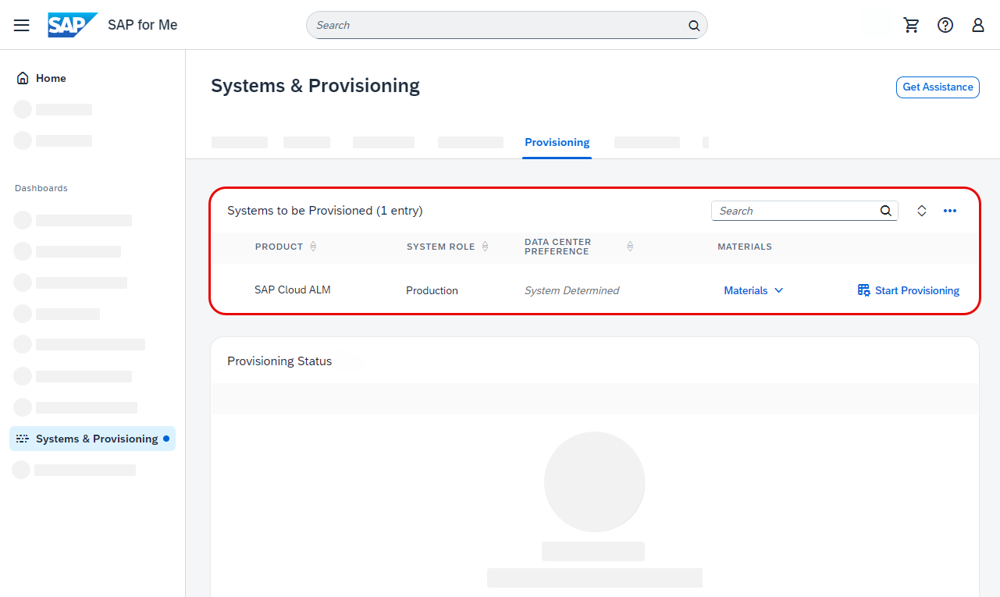
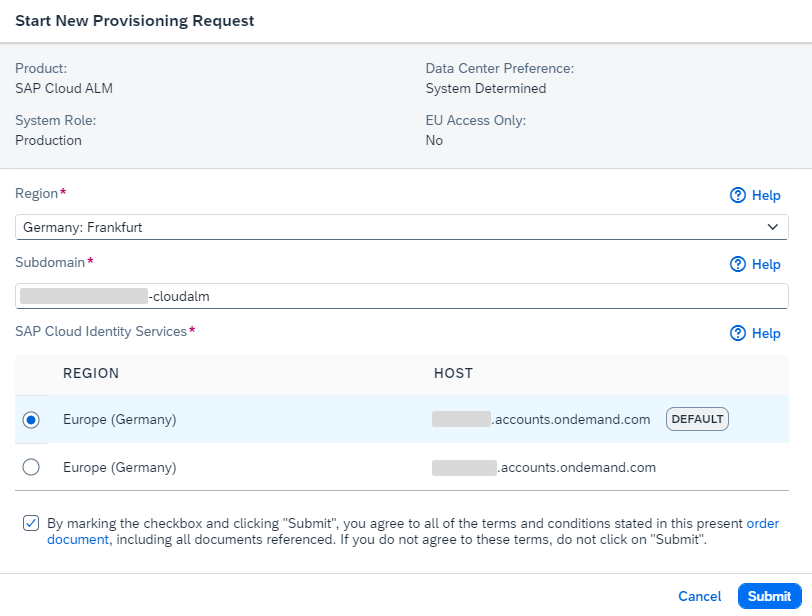
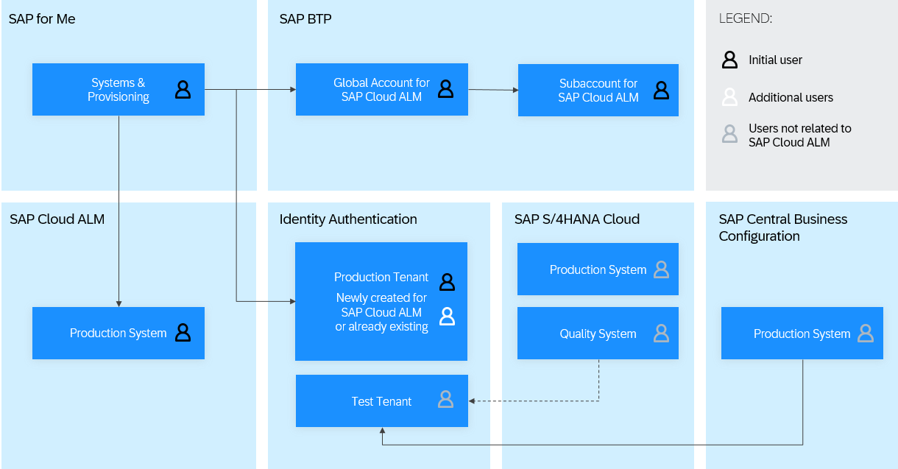

<!-- loio2ba35e64569342f097b825275248f744 -->

# Requesting SAP Cloud ALM

You can request SAP Cloud ALM on SAP for Me for yourself or for all entitled customers for whom you have sufficient permissions.

> ### Caution:  
> The S-user who requests SAP Cloud ALM receives permissions that are required for administrative tasks in the SAP BTP cockpit and in SAP Cloud ALM. In addition, the S-user is added to the Identity Authentication service \(IAS\) tenant.
> 
> Therefore, to avoid authorization issues during the configuration of SAP Cloud ALM, only carry out the following steps if you will later perform the configuration described in [Required Setup for SAP Cloud ALM](01_required_setup/required-setup-for-sap-cloud-alm-80b2c30.md).
> 
> If you request SAP Cloud ALM and then want to assign additional administrators who can perform the initial setup, refer to KBA [3248116](https://me.sap.com/notes/3248116).

<a name="loio2ba35e64569342f097b825275248f744__section_wmw_l2n_dtb"/>

## Prerequisites

-   You have an S-user with the role `Edit Cloud Data` on SAP for Me.

    You can manage your users and authorizations by following the steps described in [Manage User Authorizations](https://help.sap.com/docs/SAP_FOR_ME/758e7c8a7c5b4782bb78b17f8c7fbbda/d39d0e5f8478403c85e483b9493a7bd2.html).

-   You're assigned to the respective customer.

<a name="loio2ba35e64569342f097b825275248f744__section_cxn_yp4_ytb"/>

## Procedure

1.  Open the [Systems & Provisioning](https://me.sap.com/systemsprovisioning/provisioning) dashboard on SAP for Me.

2.  Under *Products Available for Provisioning*, find your entitlement for SAP Cloud ALM.

    

3.  Choose *Start Provisioning*.

4.  Select the geographical region in which you would like to provision SAP Cloud ALM. A suitable data center will be selected for you.

    To find out on which data centers SAP Cloud ALM is available, see [Data Center Locations](https://www.sap.com/about/trust-center/data-center.html?currentLevel=world&mode=solutions&solutionId=NZA842) in SAP Security and Trust.

    Please note that it's currently not possible to move your SAP Cloud ALM application from the data center in which it was originally provisioned to a different data center.

5.  Enter a unique subdomain name.

    The subdomain name is used for the creation of an SAP Cloud ALM-specific subaccount in the SAP Cloud ALM-specific global account on SAP BTP. It's also part of the URL that is used to access SAP Cloud ALM, as in`https://<subdomain>.<region>.alm.cloud.sap`. Therefore, the subdomain name needs to be unique.

    **Don't use a pre-existing subdomain. Choose a new subdomain name specifically for SAP Cloud ALM.** 

    Please also keep the following recommendations and restrictions in mind when choosing a subdomain name:

    -   Companies with multiple international subsidiaries or working in multiple industries should use different subdomains for each unit.

    -   We strongly recommend using the suffix `-cloudalm` at the end of the subdomain name, for example, `company-cloudalm`.

    -   Allowed characters for the name are lowercase letters, digits, and hyphens. The length of the selected name must not exceed 56 characters.

    > ### Caution:  
    > The subdomain name can't be changed after the system has been provisioned.

6.  Specify an SAP Cloud Identity Service:

    -   If you don’t have an existing productive Identity Authentication tenant, a new one will be created for you.

        We recommend reusing this newly created productive Identity Authentication tenant for other productive SAP cloud offerings \(such as SAP S/4HANA Cloud\) that you may want to use in the future.

    -   If you already have a productive Identity Authentication tenant, select it from the list.

        > ### Tip:  
        > If you have multiple Identity Authentication tenants and you're unsure about which one to select, look up the administrators of the Identity Authentication tenants that are assigned to your customer ID at [https://iamtenants.accounts.cloud.sap](https://iamtenants.accounts.cloud.sap). The administrators can give you more guidance on what to consider when selecting an Identity Authentication tenant.
        > 
        > Here are some additional recommendations:
        > 
        > -   To ensure the best performance, select an Identity Authentication tenant in a region that is close to the region of your SAP Cloud ALM tenant.
        > 
        > -   To simplify the maintenance of administrators in your Identity Authentication tenant, select an Identity Authentication tenant whose administrators will also govern the identity information for SAP Cloud ALM.
        > 
        > -   If your company has specific requirements \(functional or legal\) to not allow users from an SAP Cloud ALM tenant to access an SAP SuccessFactors tenant \(or vice versa\), both applications should use separate Identity Authentication tenants. You can find more SAP SuccessFactors-specific guidance on this topic [here](https://help.sap.com/docs/SAP_SUCCESSFACTORS_PLATFORM/568fdf1f14f14fd089a3cd15194d19cc/0271d9c4176e45ca9307e49230073240.html?version=2311#procedure).
        > 
        >     If you have no other Identity Authentication tenants available for selection, you can request a new one as described in [Tenant Model and Licensing – Getting an Additional Tenant](https://help.sap.com/docs/IDENTITY_AUTHENTICATION/6d6d63354d1242d185ab4830fc04feb1/93160ebd2dcb40e98aadcbb9a970f2b9.html?version=Cloud#getting-an-additional-tenant).

        If you've already been working with an Identity Authentication tenant but it isn't listed here, it may not be a **productive** tenant or it may be assigned to a different customer ID.

        If you later want to use a different Identity Authentication tenant for SAP Cloud ALM, you can change the assignment by following SAP Note [3020352](https://me.sap.com/notes/3020352).

        

7.  If you agree to the terms and conditions stated in the linked order document, mark the checkbox.

8.  Once you choose *Submit*, you can track the status of the provisioning under *Provisioning Status*.

9.  When the status is *Provisioning Triggered*, SAP automatically prepares SAP Cloud ALM and creates the following entities \(see also graphic below\):

    -   A global account with the name “SAP Cloud ALM” followed by your customer number.

        A global account is the realization of a contract you made with SAP. It's region-independent, and it's used to manage subaccounts, members, entitlements \(including your SAP Cloud ALM entitlement\), and quotas.

    -   A subaccount with the name “SAP Cloud ALM” that contains your SAP Cloud ALM subscription and subscriptions to the Cloud Integration Automation service and SAP Cloud Transport Management.

        Subaccounts let you structure a global account according to your organization's and project's requirements with regard to members, authorizations, and entitlements.

        > ### Caution:  
        > You can't subscribe to any additional applications in the subaccount containing your SAP Cloud ALM subscription. The subaccount is set up exclusively for SAP Cloud ALM.
        > 
        > Don't delete this subaccount or your SAP Cloud ALM subscription if you've already started using SAP Cloud ALM productively. Deleting your SAP Cloud ALM subscription causes **all created artifacts, stored data, and current configurations to be deleted** as well.

10. A mutual trust relationship between SAP Cloud ALM and the selected Identity Authentication tenant is established.

    

    If you want to know more about the role of SAP Cloud ALM and your Identity Authentication tenant in the context of SAP S/4HANA Cloud in the 3-system landscape, see [User Onboarding for SAP S/4HANA Cloud with SAP Central Business Configuration](https://help.sap.com/docs/SAP_S4HANA_CLOUD/b249d650b15e4b3d9fc2077ee921abd0/fe1022c05f4a4a9f871395f19883faac.html).

11. You receive emails containing logon information, configuration guidance, and links to support resources.

> ### Note:  
> If you've requested SAP Cloud ALM, you've been automatically signed up for cloud email notifications. This way, you can remain informed and receive timely updates regarding SAP Cloud ALM.
> 
> You can manage your notification settings in the *Cloud System Notification Subscriptions* application, as described in KBA [2900069](https://me.sap.com/notes/2900069).

**Related Information**  

[SAP for Me Online Help](https://support.sap.com/content/s4m/help.html)

[Cloud Integration Automation Service](https://help.sap.com/docs/Cloud%20Integration%20Automation%20Service)

[SAP Cloud Transport Management](https://help.sap.com/docs/Cloud%20Integration%20Automation%20Service)

